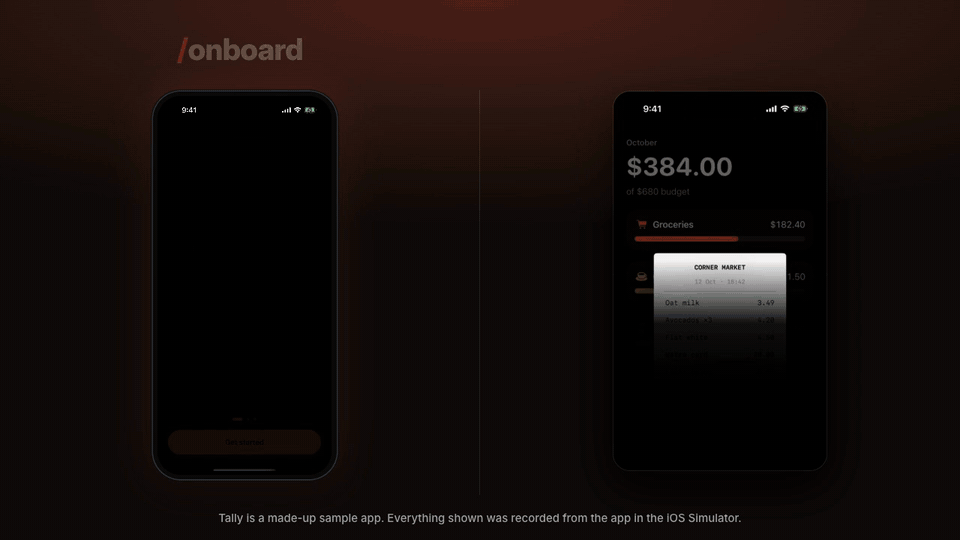

# app-glowup

**Give your iOS app a glow-up.** Two [Claude Code](https://claude.com/claude-code) skills that turn your app into an animated onboarding and a full set of marketing content.



| Skill | What it does |
|---|---|
| **`/onboard`** | Builds animated, interactive onboarding in SwiftUI, wires it into your app, and checks every screen in the iOS Simulator. |
| **`/promo`** | Records your app's real features in the Simulator and turns them into a launch video, video ads, an App Store preview, App Store screenshots, ad copy and a UGC kit. |

## Install

```
/plugin marketplace add Halal375657/app-glowup
/plugin install app-glowup@app-glowup
```

Or with [skills.sh](https://skills.sh): `npx skills add https://github.com/Halal375657/app-glowup`

## Use

Open Claude Code in your app's folder:

```
/onboard 3 screens, soft 3D clay style
/promo receipt scanning
/promo --formats launch --music free --voice none
```

Each skill reads your app, shows you a plan, and **waits for your approval before generating anything or spending credits**.

## What `/promo` makes

| Output | Spec |
|---|---|
| Launch video | 1920×1080 (or vertical/square), 15–25 s, cut on the beat, poster + share copy |
| Reel ads, one per hook | 1080×1920, safe zones for Reels and TikTok |
| Feed and square ads | 1080×1350, 1080×1080 |
| App Store preview | 886×1920, 15–30 s, screen capture only (Guideline 2.3.4) |
| App Store screenshots | 1320×2868 |
| Ad copy | Meta, TikTok, Google and App Store, within character limits |
| UGC kit | Clean clips, transparent phone and caption overlays, music |

Every file is checked against the platform specs before delivery.

## Audio: off, free or paid

You choose per run. Nothing is added that you didn't ask for.

| | Free | Paid ([fal](https://fal.ai)) |
|---|---|---|
| Music | Generated by the skill (offline, safe for ads), or your own track | ElevenLabs Music, MiniMax |
| Voiceover | Kokoro (local) | ElevenLabs |
| Sound effects | Bundled library | — |

## Requirements

- Claude Code on a **Mac** with Xcode and the iOS Simulator (iOS 17+ for the SwiftUI templates)
- `ffmpeg`, Node 18+, Python 3
- For `/promo`: the Hyperframes skills — `npx hyperframes skills update hyperframes-core hyperframes-animation hyperframes-creative hyperframes-keyframes hyperframes-cli media-use`
- Optional: a fal API key in `FAL_KEY` for generated art and paid audio

These skills drive Xcode and the Simulator, so they don't run in claude.ai's cloud sandbox.

## Built-in rules

- Claims in ads come only from your app's own copy.
- App Store previews contain only real screen captures.
- No fake testimonials or AI "customers"; AI content is flagged for labeling.
- Music and fonts are cleared for commercial use, with a license record per run.

## Credits

`/promo` follows the workflow of [/brag](https://github.com/latent-spaces/brag) (MIT) by Shunit Haviv Hakimi and composes video with [Hyperframes](https://hyperframes.heygen.com). Fonts: Inter and DM Serif Display (SIL OFL 1.1).

The demo app, Tally, is made up.

## License

MIT
